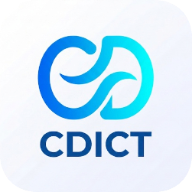

<p align="center">
  
</p>

<p align="center">
  <strong>CDict</strong> · An offline-first IELTS dictionary for Android
</p>

<p align="center">
  <a href="README.zh-CN.md">简体中文</a> · English
</p>

<p align="center">
  <strong>Kotlin</strong> · <strong>Jetpack Compose (Material 3)</strong> · <strong>Room</strong> · <strong>SQLite FTS5</strong>
</p>

**CDict** is an offline-first IELTS dictionary for Android, built with Kotlin, Jetpack Compose (Material 3), and Room. The package and application ID are `com.chloemlla.cdict`.

> **Current release `1.0.1`** (versionCode `2`) · `minSdk 26` / `targetSdk 37` / `compileSdk 37` · Compose BOM `2024.12.01` · Room `2.8.4` · Kotlin/JVM 17
>
> The full dictionary **works completely offline**; the only permissions required are `INTERNET` for optional online translation and pronunciation.

---

## Table of Contents

- [Overview & Highlights](#overview--highlights)
- [Screens](#screens)
- [Features](#features)
- [Tech Stack](#tech-stack)
- [Architecture](#architecture)
- [Getting Started](#getting-started)
- [Data Pipeline](#data-pipeline)
- [CI / CD](#ci--cd)
- [Version History](#version-history)
- [Verification Policy](#verification-policy)
- [License](#license)

---

## Overview & Highlights

| | |
|---|---|
| 🗂 **Offline-first** | 49,213 words across 7 IELTS frequency groups, bundled into the APK and copied into a Room database on first launch. |
| 🔍 **Smart search** | English full-text search (SQLite FTS5) over word / translation / definition, Chinese substring search, plus **Levenshtein typo suggestions** ("Did you mean …"). |
| 🔊 **Pronunciation** | Three-tier fallback (vivo TTS → Youdao → system TTS) with on-disk audio caching — no audio files shipped. |
| 🌐 **Online translation** | Built-in translation engine backed by the vivo gateway, with a **three-layer cache**. |
| 🧠 **Study mode** | Adaptive spaced repetition weighted by IELTS frequency band, with a distractor engine and next-day MCQ review. |
| 📅 **Daily recommendations** | A fully offline daily feed mixing review, new core words, and easy transition words in a **3:5:2 ratio**. |
| 🔒 **Privacy** | Data is entirely local; only `INTERNET` is requested, and nothing is collected or uploaded. |
| 🛡 **Crash reporting** | Integrated **Lumen Crash SDK** capture with an in-app Compose report screen. |

---

## Screens

A four-tab bottom navigation bar (a side rail on large screens):

1. **背词 · Study** — spaced word-learning mode
2. **词典 · Dictionary** — offline dictionary & word detail
3. **翻译 · Translation** — online translation
4. **推荐 · Recommendation** — daily recommendation feed

Navigation is responsive: the bottom bar collapses into a navigation rail on large screens, and it supports Android system back / gesture navigation with word-detail slide transitions.

---

## Features

### 🗂 Offline Dictionary

| Capability | Description |
|---|---|
| Corpus | 49,213 words across 7 IELTS frequency groups |
| English search | Full-text search (SQLite FTS5) over English word, translation, and definition |
| Chinese search | Chinese substring search via `LIKE` over word and translation |
| Ranking | Results re-ranked **Exact > Prefix > Frequency**, so core IELTS words surface first |
| Typo tolerance | When a query finds nothing, a "Did you mean: …" suggestion is offered within a bounded **Levenshtein** edit distance (≤ 2) |
| Sorting | Word list supports multiple sort modes (by frequency / alphabetical / reverse-alphabetical) |
| Infinite scroll | Word list loads in pages for smooth, incremental browsing |
| Offline storage | Room copies the bundled asset `dict.db` into the app database on first launch |

### 🧩 Word Detail

Tapping an entry opens a detail page showing:

- **Phonetics** — UK `phoneticUk` + US `phoneticUs`
- **Definition & translation** — English `definition` + Chinese `translation`
- **Mnemonic** — `mnemonic`
- **Frequency** — `frequencyGroup` + IELTS `frequency`
- **Roots** — `roots` and their meanings
- **Derived terms** — `derivedTerms`
- **Historical heatmap** — `heatmap` of appearance scores over time
- **Real exam sentences** — `sentences` (English + Chinese), up to 10 per word
- **Pronunciation buttons** for UK / US accent

### 🔊 Pronunciation

The detail page provides **UK / US** pronunciation buttons. Speech is produced by a default **vivo TTS** client and falls back through three tiers — no audio files are packaged:

```
Youdao static pronunciation (dict.youdao.com/dictvoice; word / sentence)
  → vivo TTS synthesis (POST https://vivotrans.vivo.com.cn/fy/tts)
  → Android system TextToSpeech
```

Any tier failure (timeout / non-2xx / corrupted audio / network unavailable) automatically falls back to the next tier. Dictionary browsing and offline search are fully unaffected when pronunciation is unavailable. The Youdao `dictvoice` endpoint reliably reads single words; for whole sentences it first tries the sentence whole, and on failure splits it **word-by-word** by spaces, falling back to vivo → system TTS only if that also fails.

`VivoTtsClient` (reverse-engineered from `com.vivo.translator`):

- Request body is **JSON** (not a form), with `auf=audio/L16;rate=16000`. Responses may be MP3 or container-less PCM; the format is detected before playback and PCM is wrapped in a WAV header. A `{"errorResult":{...}}` response is treated as an explicit error, not audio.
- **HMAC-SHA256** signature via `Sign.sign` (`hmacSha256Hex`); headers carry `product/model/sysVer/appVer` client fingerprints.
- Uses credentials **independent from the translation engine**: `appId=1336541186` / `appKey=9925f42b…`; UK accent `langType=en-GBR`, US accent `en-USA`.

**Audio caching.** Pronounced audio is cached on disk so repeated lookups are instant and offline-friendly:

- Files are keyed by the **MD5 of `<accent>:<text>`**, giving a stable short filename per word + accent.
- A **50 MB LRU** budget evicts least-recently-used files.
- The detail page **pre-fetches** pronunciation ahead of use.

> ⚠️ **Disclaimer:** The vivo TTS endpoint is a private interface; `appId` / `appKey` are client-side constants and may stop working or change at any time. Pronunciation is a convenience feature, not a core dependency — the dictionary itself is fully offline.

### 🌐 Online Translation

A **Translation** tab runs an embedded online translation engine:

- Backed by the **vivo translation gateway** (reverse-engineered from `com.vivo.translator` 4.5.9.0, same source as `fanyiji-rev/translate.js`).
- **Keyless direct access**: V2 signature-free channel `POST https://vivotrans.vivo.com/translation/query`.
- **Language directions**: auto→Chinese, auto→English, Chinese→English, English→Chinese (full vivo direction set).
- **Batch translation**: multiple lines are merged on `\n` into a single request and split back line-by-line.
- **Response extras**: echoes the source / target language and phonetics.
- **Phrase speech**: English content can be read aloud (vivo TTS) alongside the Chinese translation, with a read-aloud icon next to the result.

**Three-layer cache.** Translation results are served from a layered cache (memory LRU → Room-persisted disk → network) with a custom in-memory `MemoryLruCache<string, TranslationResult>` in addition to a Room-backed `RoomTranslationCache`, so repeated translations are instant and offline-after-first-use.

> ⚠️ **Disclaimer:** The gateway is a private interface; its credentials are client-side constants and may change. Translation is a convenience feature, not a hard dependency — the dictionary core is fully offline.

### 🧠 Study Mode (spaced repetition)

The **Study** tab is an adaptive spaced word-learning mode:

- **Next-day MCQ review**: after learning, words come back the next day as multiple-choice questions.
- **Adaptive spaced repetition (ASR)**: review intervals progress through a base ladder (e.g. `1 → 3 → 7 → 15 → 30` days) tuned by your answers.
- **Frequency-weighted intervals**: the interval is scaled by the word's IELTS frequency band — high-frequency (core) words get *shorter* intervals to keep focus, while obscure words stretch theirs.
- **Distractor engine**: review questions pick distractors that are strictly preferred to come from the **same frequency group** before falling back to the ±1 band, making the choices purposefully hard.
- **Error attribution & retry**: wrong answers are immediately re-queued within the session with feedback.
- **Success tone**: a correct review answer plays a short success sound.
- **Adaptive daily goal** with a `StudyStatus` memory state machine persisted in a separate `StudyDatabase`.

### 📅 Daily Recommendations

The **Recommendation** tab builds a **fully offline** daily feed:

- A **3:5:2 ratio** across three word pools (PRD golden mix):
  1. **Review** (~30%) — words due by the forgetting curve / yesterday's errors.
  2. **Simple transition** (~20%) — unlearned, ultra-high-frequency words (group 1) for a smooth flow.
  3. **Core new** (remainder) — unlearned new words in your target IELTS frequency groups (1–3), highest frequency first.
- The daily goal is configurable; raising it appends new 3:5:2 slices and lowering it trims from the tail.
- Progress is persisted per-day so the feed stays stable across app launches.

### 🔒 Permissions & Privacy

- Only **`INTERNET`** is requested, for optional online translation and pronunciation (vivo / Youdao).
- Dictionary data is entirely local; **no personal information is collected or uploaded**.

---

## Tech Stack

| Layer | Choice |
|---|---|
| Language | Kotlin / JVM 17 |
| UI | Jetpack Compose (Material 3), Compose BOM `2024.12.01`, experimental window-size-class for responsive layouts |
| Persistence | Room `2.8.4` (dictionary + study + translation-cache databases), SQLite FTS5 |
| Async / threading | Coroutines, repositories |
| Min / Target / Compile SDK | 26 / 37 / 37 |
| Crash reporting | Lumen Crash SDK (version auto-resolved at build time) |

---

## Architecture

A single `:app` module, organized by responsibility:

```
com.chloemlla.cdict
├── core
│   ├── data        # Room: Entities / DAO / Database / Repository
│   ├── audio       # PronunciationPlayer + VivoTtsClient (vivo → Youdao → TTS fallback)
│   ├── search      # SearchEngine: relevance ranking + Levenshtein typo suggestions
│   └── translate   # vivo translation-gateway client + models (embedded translation engine)
└── ui             # Compose: CdictApp (4-tab nav) / Study* / Dictionary* / Translate* / Recommendation*
```

- The data layer loads the bundled dictionary via Room's `createFromAsset("dict.db")`, copies it into the app database on first open, and exposes user-visible loading/error states so a missing asset never silently degrades to fake data.
- The translation engine `core/translate` faithfully reproduces `translate.js`'s form encoding, batch splitting, and (optional) X-AI-GATEWAY signature, with unit tests.
- The search layer `core/search` re-ranks FTS results and provides Levenshtein "did you mean" suggestions.

---

## Getting Started

- **Android Studio:** open the repo root — the IDE uses the Gradle wrapper automatically.
- **Command line:** `./gradlew :app:assembleDebug` (requires generating the dictionary asset first, below).

> **Note:** the AI-annotated dictionary ships in the repo at `scripts/CDict-dict.db`. CI stages it into the (git-ignored) `app/src/main/assets/dict.db` before building; a local `./gradlew :app:assembleDebug` needs that copy present — run `cp scripts/CDict-dict.db app/src/main/assets/dict.db` on a fresh checkout.

---

## Data Pipeline

The dictionary ships as one committed, AI-annotated SQLite asset: `scripts/CDict-dict.db` (49,213 words, 7 groups). Its annotation fields — `emotionColor`, `register`, `nuanceDescription`, `usageWarning`, `collocations` — are produced by `scripts/annotate_dictionary.js` (node:sqlite, no Python). CI stages the asset verbatim and validates it:

```bash
cp scripts/CDict-dict.db app/src/main/assets/dict.db
python scripts/validate_dictionary_asset.py app/src/main/assets/dict.db \
  --expected-word-count 49213 --expected-groups 7
```

`app/src/main/assets/dict.db` is a git-ignored build copy; it stays **compressed** (no `noCompress` override) and ships via AAB per-device delivery. `scripts/convert_dictionary.py` remains available for rebuilding an unannotated base from an authorized export if the source data ever needs regenerating.

---

## CI / CD

`.github/workflows/build.yml` runs debug unit tests and lint on push / pull request. The signed release build is triggered either by a manual **`workflow_dispatch` (`publish=true`)** or by a **`v*` tag**. Release signing uses only these repository secrets:

- `KEYSTORE_BASE64`
- `KEYSTORE_PASSWORD`
- `KEY_ALIAS`
- `KEY_PASSWORD`

The pipeline: `keytool` verifies the decoded keystore → build APK / AAB → `apksigner` verifies the APK → generate SHA-256 checksums → upload artifacts → clean up temporary signing material. No keystore or plaintext credentials live in the repo. The **Lumen Crash SDK version is auto-resolved at build time** so it stays current without manual bumps.

Release builds enable **R8 minification** (`proguard-android-optimize.txt` + `proguard-rules.pro`) and **resource shrinking**, and emit per-ABI split APKs (`*universal*.apk` is the all-architecture package; the AAB lets Google Play split per device). A dedicated `releaseAab` build type produces the AAB with resource shrinking off (AGP cannot combine ABI splits + resource shrink + AAB in one build type; Play performs per-device shrinking at serve time).

---

## Version History

A narrative of the development history, reconstructed from the commit log.

### 1.0.x — Study, Recommendations & polish (current)

The app grew from a dictionary into a daily learning companion:

- **Spaced study mode**: introduced next-day MCQ review (`b16aa27`), then adaptive spacing with a distractor engine, error attribution, and adaptive daily goals (`8c383c5`), a success tone on correct answers (`752ad76`), frequency-weighted review intervals (`2ea60cd`), strict same-frequency-group distractor preference (`a4e12e4`), and a `StudyDatabase` v2 fix for a Room identity-hash crash (`d626cdf`).
- **Daily recommendations**: an offline feed mixing review / core-new / simple-transition on a 3:5:2 ratio, with a configurable daily goal (`9cc372e`).
- **Offline search quality**: Levenshtein typo suggestions and Exact > Prefix > Frequency ranking so core words surface first (`5f7d90e`).
- **Audio caching**: pronunciation is now cached on disk by MD5 key within a 50 MB LRU and pre-fetched on the detail page (`c1be4e9`); Youdao became the first tier and can read whole sentences (`9a91bde`, `8a4fc36`).
- **Study & search fixes**: mark DAO call suspend, pin Robolectric SDK in tests, and finish the recommendation rail layout (`34b6c0d`, `5edef02`, `09e30ff`).

### 1.0 — Translation, audio & release hardening

- **Online translation**: added the vivo translation gateway with full direction set and language list (`57c7871`), then a three-layer cache with Room persistence (`a73415b`, `c3a551a`) and phrase read-aloud with a transcription icon (`8ef0898`).
- **Pronunciation via vivo TTS**: replaced the static CDN with synthesized speech, including PCM format detection and WAV wrapping (`1875629`, `33a1aec`, `f2b7ec4`).
- **Vivo direction normalization** so phonetics no longer show raw JSON (`3135920`).
- **Crash reporting**: integrated the Lumen Crash SDK with an in-app Compose report screen (`4894f6f`).
- **Release build fixes**: declared the `releaseAab` build type as a dedicated AAB channel (R8 minify on, resource shrink off) and serialized kapt to stop Room schema-export races (`cb344ea`, `f99ef79`, `a7f462b`, `25a544f`, `75e610e`, `18d1106`).

### 0.9 — Dictionary core, schema & CI

- **Offline dictionary**: built the Room `words` entity and FTS table, matched them to the bundled `dict.db` schema, and added a prepackaged-schema validation regression test to stop startup crashes (`a3cece9`, `1d09815`, `4f6efed`, `cbc6273`, `5570879`, `c30597b`, `66e2bfb`).
- **Word detail & relations**: wired pronunciation and rendered word-detail relations (`078df34`).
- **Launcher branding**: launcher icons across all densities referenced from the manifest (`15a1627`, `b2bf234`, `a03b79d`).
- **Data pipeline**: scripts to fetch and convert an authorized export into `dict.db`, and to validate it (`a3127ee`, `96d67e9`).
- **Continuous delivery**: enabled automatic CDict releases with signed per-ABI APKs and AGP's actual split naming in release assets (`8c2713d`, `82b82f0`, `6ac92e2`, `7933e19`, `a456828`, `94be8c8`).

---

## Verification Policy

Repository policy requires Android builds and tests to run in **GitHub Actions**; please do **not** run Gradle or Android build/test commands on your local device.

---

## License

This project is licensed under the **GNU Affero General Public License v3.0**. See [LICENSE](LICENSE).